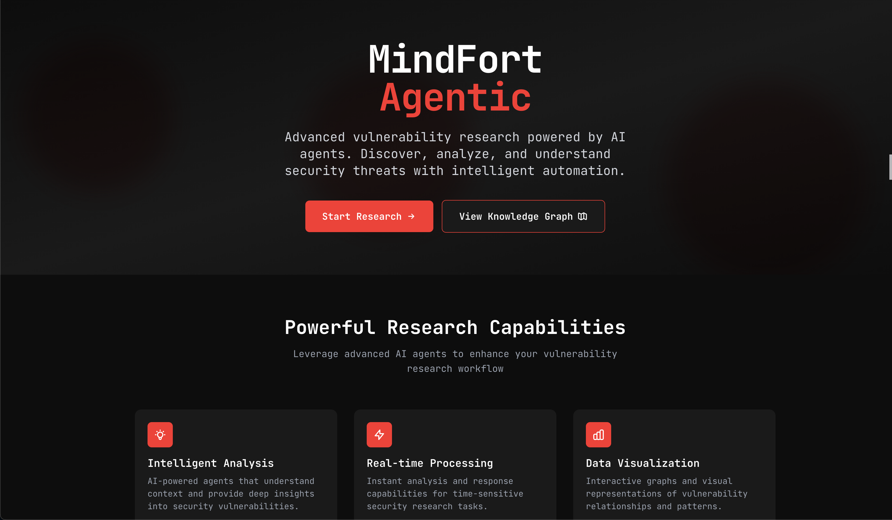

# MindFort Agentic - Vulnerability Research Platform

## Live Deployment

Deployment - https://research-vuln-agent.vercel.app/

## Overview

MindFort Agentic is an advanced vulnerability research platform that leverages AI agents to continuously test, discover, and analyze security vulnerabilities in real-time. This system demonstrates autonomous security agents working as a team of elite hackers to deliver comprehensive penetration testing, vulnerability analysis, and compliance insights.

## 🎯 Project Objective

This technical submission implements a **Vulnerability Knowledge-Graph & Multi-Agent Reasoning Chat System** with the following core capabilities:

- **Ingest Findings**: Process and store vulnerability findings from multiple security scanners
- **Knowledge Graph Creation**: Model entities as nodes with rich relationships capturing dependency lineage, shared exploit techniques, common root causes, and temporal patterns
- **AI Agent Enrichment**: Intelligent agents analyze and infer new relationships autonomously
- **Multi-Agent Chat System**: Interactive conversation interface with reasoning capabilities
- **Visual Graph Interface**: Interactive visualization of vulnerability relationships and patterns

## ️ Architecture

### Frontend (Next.js + TypeScript)

- **Framework**: Next.js 15.3.5 with TypeScript
- **UI Library**: React 19 with Tailwind CSS
- **Graph Visualization**: Cytoscape.js for interactive knowledge graph
- **Deployment**: Vercel-ready with live hosting

### Backend (Python + Flask)

- **API Framework**: Flask with CORS support
- **AI Framework**: LangGraph for multi-agent orchestration
- **Database**: Neo4j AuraDB for graph storage
- **AI Models**: LiteLLM integration supporting multiple models (GPT-4o, Gemini, Sonnet, Grok)

### Multi-Agent System

The platform features a sophisticated multi-agent architecture with specialized agents:

1. **🔍 Analysis Agent**: Deep vulnerability analysis and severity assessment
2. **🔗 Correlation Agent**: Pattern recognition and attack chain identification
3. **⚠️ Risk Assessment Agent**: Risk scoring and asset criticality evaluation
4. **💡 Recommendation Agent**: Mitigation strategies and remediation prioritization
5. **🛠️ Tools Agent**: Database queries and data retrieval

## ✨ Key Features

### Intelligent Vulnerability Analysis

- **Multi-dimensional Analysis**: Severity, impact, attack vectors, and temporal patterns
- **Pattern Recognition**: Identifies similar vulnerabilities and attack chains
- **Risk Scoring**: Calculates comprehensive risk scores based on multiple factors

### Interactive Knowledge Graph

- **Visual Relationships**: Interactive graph showing vulnerability connections
- **Entity Types**: Findings, Vulnerabilities, Assets, Packages with color-coded nodes
- **Relationship Types**: HAS_VULNERABILITY, AFFECTS, RELATED_TO, and AI-inferred connections
- **Real-time Exploration**: Click nodes to view detailed properties and relationships

### Advanced Chat Interface

- **Multi-Agent Mode**: Watch multiple specialized agents collaborate in real-time
- **Single Agent Mode**: Direct interaction with a unified security agent
- **Streaming Responses**: Real-time streaming of agent reasoning steps
- **Trace Visualization**: View detailed agent execution traces and reasoning

### Data Enrichment

- **AI-Powered Insights**: Agents autonomously discover new relationships
- **Temporal Analysis**: Pattern recognition across time-based vulnerability data
- **Cross-Reference Analysis**: Links vulnerabilities across different scanners and assets

## 📊 Sample Data

The system processes comprehensive vulnerability findings including:

- **OWASP ZAP**: Web application vulnerabilities (SQL injection, XSS, CORS issues)
- **BurpSuite**: Manual testing findings (session management, access control)
- **Semgrep**: Code analysis (weak cryptography, insecure practices)
- **Trivy**: Container image vulnerabilities (CVE analysis, outdated dependencies)
- **Snyk**: Software composition analysis (dependency vulnerabilities)
- **Custom Probes**: Cloud configuration and audit logging issues

## 🛠️ Technical Implementation

### Knowledge Graph Schema

```cypher
// Core Entities
(Finding)-[:HAS_VULNERABILITY]->(Vulnerability)
(Finding)-[:AFFECTS]->(Asset)
(Vulnerability)-[:AFFECTS]->(Package)

// AI-Inferred Relationships
(Finding)-[:RELATED_TO {reason: "AI analysis"}]->(Finding)
```

### Multi-Agent Workflow

1. **User Query Processing**: Natural language understanding and intent classification
2. **Agent Orchestration**: Dynamic routing to specialized agents based on query type
3. **Tool Execution**: Database queries, analysis, and correlation tools
4. **Result Synthesis**: Combining insights from multiple agents
5. **Response Generation**: Comprehensive, contextual security insights

### Real-time Streaming

- **Server-Sent Events**: Real-time streaming of agent reasoning steps
- **Trace Tracking**: Unique trace IDs for debugging and analysis
- **LangSmith Integration**: Detailed execution traces and monitoring

## 🚀 Getting Started

### Prerequisites

- Node.js 18+ and Python 3.11+
- Neo4j AuraDB instance
- LiteLLM API credentials

### Environment Setup

#### Frontend Setup

```bash
# Navigate to frontend directory
cd mindfort-agentic

# Install dependencies
npm install

# Start development server
npm run dev
```

#### Backend Setup

```bash
# Navigate to backend directory
cd backend

# Create virtual environment
python -m venv venv311

# Activate virtual environment
# On macOS/Linux:
source venv311/bin/activate
# On Windows:
venv311\Scripts\activate

# Install dependencies
pip install -r requirements.txt

# Start Flask server
python app.py
```

### Environment Variables

Create a `.env` file in the backend directory:

```env
# Neo4j Configuration
NEO4J_URI=your_neo4j_uri
NEO4J_USER=your_username
NEO4J_PASSWORD=your_password

# LiteLLM Configuration
LITELLM_BASE_URL=your_litellm_url
LITELLM_API_KEY=your_api_key

# LangSmith (Optional)
LANGSMITH_API_KEY=your_langsmith_key
```

### Data Ingestion

```bash
# Navigate to scripts directory
cd mindfort-agentic/scripts

# Ingest sample findings
npm run ingest-findings

# Enrich graph with AI analysis
npm run enrich-graph
```

## 🎨 UI/UX Features

### Modern Design System

- **Dark Theme**: Professional security-focused interface
- **Responsive Design**: Works seamlessly across devices
- **Interactive Elements**: Hover effects, animations, and smooth transitions
- **Agent Visualization**: Real-time agent activity indicators

### User Experience

- **Intuitive Navigation**: Clear pathways between chat, graph, and trace views
- **Real-time Feedback**: Live streaming of agent reasoning
- **Contextual Information**: Rich tooltips and detailed property panels
- **Accessibility**: Keyboard navigation and screen reader support

## 🔧 Advanced Features

### Agent Reasoning Transparency

- **Step-by-step Execution**: View each agent's reasoning process
- **Tool Usage Tracking**: See which tools each agent uses
- **Decision Rationale**: Understand why agents make specific recommendations

### Graph Analytics

- **Interactive Exploration**: Zoom, pan, and filter graph elements
- **Relationship Analysis**: Discover hidden connections between vulnerabilities
- **Temporal Patterns**: Visualize vulnerability discovery over time

### Security Insights

- **Attack Chain Identification**: Map potential attack paths
- **Risk Prioritization**: AI-driven remediation recommendations
- **Compliance Mapping**: Link vulnerabilities to security standards

## 🚀 Deployment

### Vercel Deployment

```bash
# Build and deploy frontend
cd mindfort-agentic
npm run build
vercel --prod
```

### Backend Deployment

- Deploy Flask app to your preferred cloud provider
- Configure environment variables
- Set up CORS for frontend communication

## ⚡ Performance & Scalability

- **Efficient Graph Queries**: Optimized Cypher queries for large datasets
- **Streaming Responses**: Real-time updates without blocking
- **Caching Strategy**: Intelligent caching of frequently accessed data
- **Modular Architecture**: Easy to extend with new agents and capabilities

## 🔒 Security Considerations

- **Input Validation**: Comprehensive validation of user inputs
- **Database Security**: Parameterized queries to prevent injection
- **API Security**: CORS configuration and rate limiting
- **Data Privacy**: Secure handling of vulnerability data

## 🎯 Future Enhancements

- **Machine Learning Integration**: Predictive vulnerability analysis
- **Automated Remediation**: AI-driven patch generation and testing
- **Compliance Automation**: Automated compliance report generation
- **Integration APIs**: Connect with existing security tools and workflows

## 📁 Project Structure

```
research-vuln-agent/
├── backend/                    # Python Flask backend
│   ├── app.py                 # Main Flask application
│   ├── multi_agent_system.py  # Multi-agent orchestration
│   ├── langgraph_agent.py     # Single agent implementation
│   ├── enrich_graph.py        # Graph enrichment utilities
│   └── requirements.txt       # Python dependencies
├── mindfort-agentic/          # Next.js frontend
│   ├── app/                   # Next.js app directory
│   │   ├── chat/             # Chat interface
│   │   ├── graph/            # Graph visualization
│   │   └── trace/            # Agent trace viewer
│   ├── lib/                  # Utility libraries
│   ├── scripts/              # Data ingestion scripts
│   └── package.json          # Node.js dependencies
└── README.md                 # This file
```

## 🐛 Troubleshooting

### Common Issues

1. **Neo4j Connection Errors**

   - Verify environment variables are set correctly
   - Check Neo4j AuraDB instance is running
   - Ensure network connectivity

2. **LiteLLM API Errors**

   - Verify API key and base URL
   - Check model availability
   - Ensure proper authentication

3. **Agent Execution Issues**
   - Check database schema matches expected structure
   - Verify all required tools are properly registered
   - Review agent state management

## Preview




This project demonstrates advanced AI agentic capabilities in cybersecurity, showcasing how autonomous agents can revolutionize vulnerability research and security analysis workflows.

**Built with ❤️ for MindFort's autonomous security vision**
